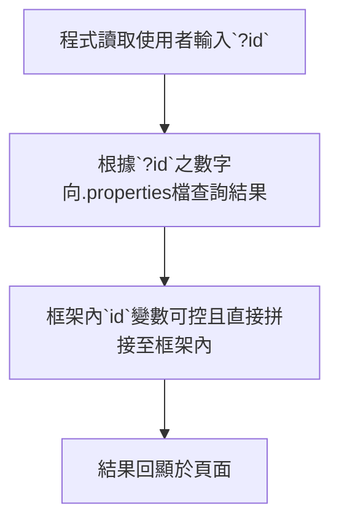

# Expressionism
- 在code(`Expressionism\src\main\java\tw\devcore\wargame\controller`):
  

* 可以看到：
1. IndexController(是一個 Spring MVC 控制器)，負責處理`/` URL 的 GET 請求。
2. `id` 參數可以通過查詢字符串傳入，如果未提供 `id`，則會隨機生成一個數字並作為 `id`。
3. controller 將`FLAG`儲存在用戶的 HttpSession 中。

我們嘗試 GET `?id=`，的確在不同數字下可以看到不同結果。
該結果的定義在程式碼檔案路徑：`\Expressionism\src\main\resources\messages\`下有三個檔案做定義回顯結果，以`messages_zh.properties`為例：
```java=
life.quotes.1=人生是一段旅程，而不是終點。
life.quotes.2=擁抱你那美麗的混亂。
life.quotes.3=到最後，我們只會後悔那些未曾嘗試的機會。
life.quotes.4=預測未來的最好方法是創造未來。
life.quotes.5=生活中的困難是為了讓我們變得更好，而不是更痛苦。
life.quotes.6=生活中10%是發生在我們身上的事，90%是我們對這些事的反應。
life.quotes.7=活在當下，讓每一刻都變得美好。
life.quotes.8=成功不是幸福的鑰匙，幸福才是成功的鑰匙。
life.quotes.9=每天可能並不完美，但每天都有值得珍惜的東西。
life.quotes.10=生活不是等待暴風雨過去，而是學會在雨中起舞。
life.quotes.11=Life is pain dayo.
```
4. 接下來因為在程式碼(`Expressionism\src\main\webapp\WEB-INF\views\index.jsp`)中，出現了：
    - 
    - `id` 可由使用者任意輸入，結果為第三點所述。
    - 但因為`id`是使用者可控，因此猜測可能存在Injection問題。

- 到目前為止梳理一下程式流程：

5. 接著我們可以試著輸入`${1+1}`來驗證是否回顯第二個(?id=2)結果，證明是否存在injection問題。
    - 直接輸入`?id=${1+1}`會因為RPC所以不能正常顯示，因此要將`${1+1}`URL encode成`%24%7B1%2B1%7D`：
    - 

6. 確認有Injection問題，接著要利用此漏洞來得到Flag
7. 最後我們根據code(`Expressionism\src\main\java\tw\devcore\wargame\controller`)得到 payload：`?id=%24%7BFLAG%7D`

